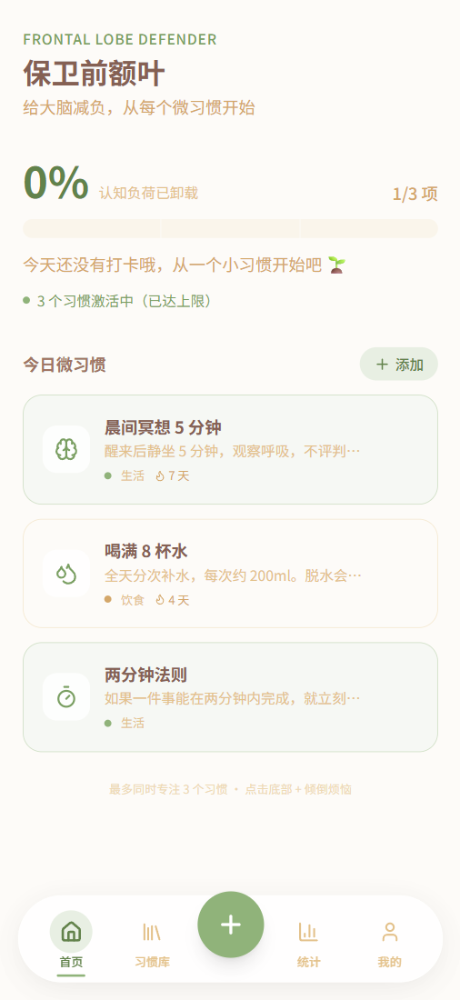
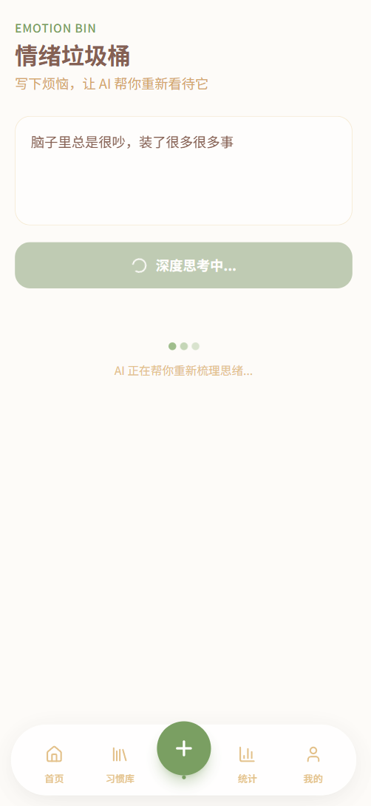
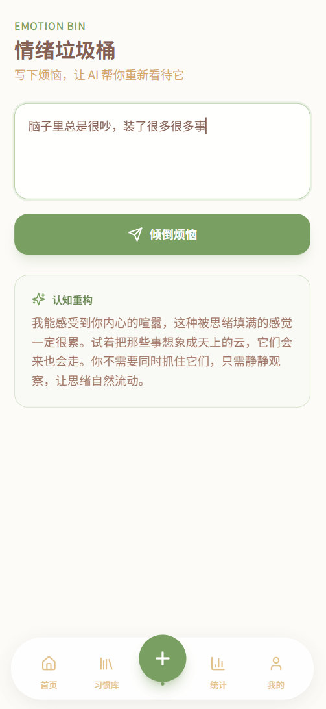
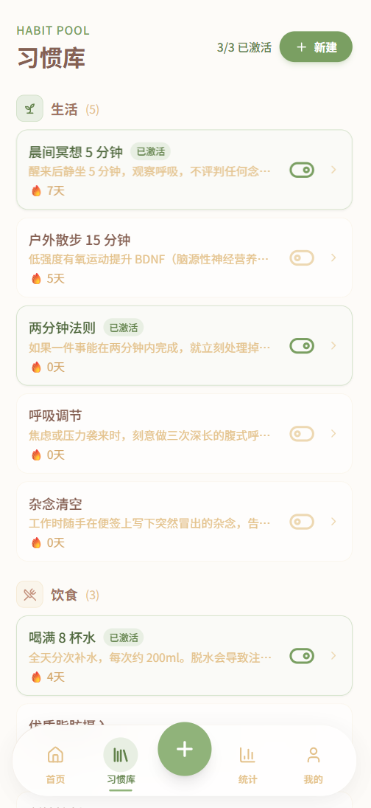
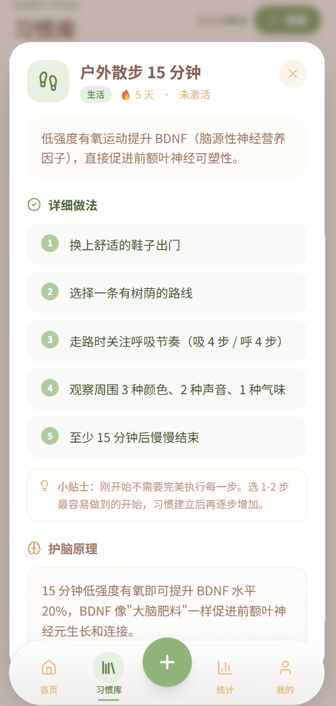
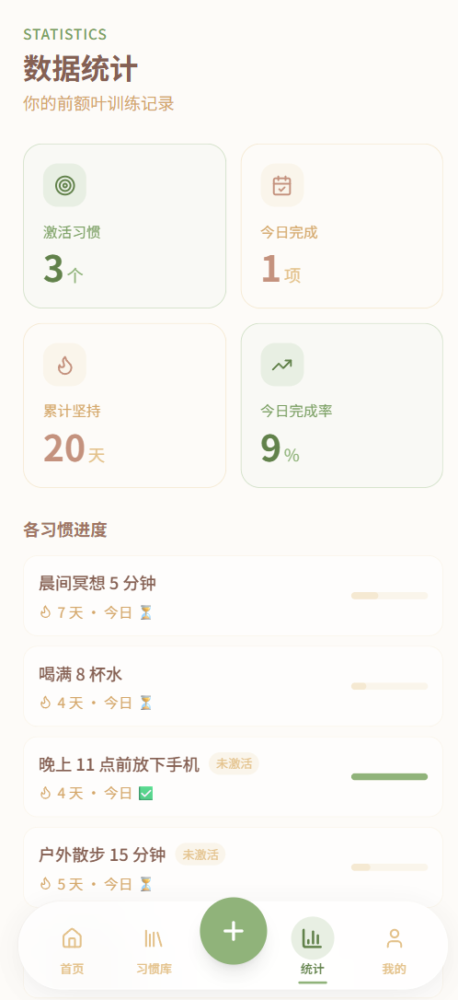
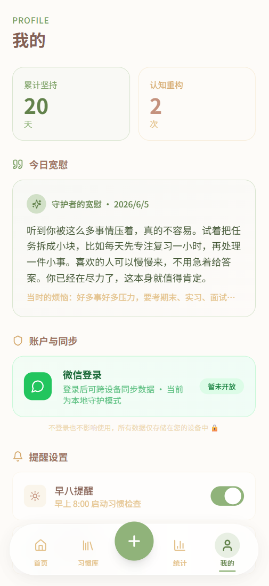

<div align="center">
  
  <h1>保卫前额叶</h1>
  <h3>Frontal Lobe Defender</h3>
  <p><em>极简主义认知负荷管理工具 · 用 AI 重构你的每一次内耗</em></p>
</div>

---

## 🌿 项目愿景

现代人每天处理的信息量相当于 15 世纪一个人一生的信息量。决策疲劳、注意力碎片化、情绪内耗正在无声地消耗我们最宝贵的认知资源——**前额叶皮层**。

保卫前额叶是一款轻量级 AI 驱动的心理健康辅助应用。它不要求你冥想 30 分钟，不需要你写长篇日记——**只需 3 分钟**：写下烦恼、获得 AI 的认知重构建议、完成一个微习惯打卡。让大脑减负，从每一次微小的行动开始。

---

## 📸 视觉预览

<table>
  <tr>
    <td align="center"><b>🏠 首页仪表盘</b></td>
    <td align="center"><b>🧠 情绪垃圾桶 · AI 思考中</b></td>
    <td align="center"><b>✨ 认知重构结果</b></td>
  </tr>
  <tr>
    <td></td>
    <td></td>
    <td></td>
  </tr>
</table>

<table>
  <tr>
    <td align="center"><b>📋 习惯库</b></td>
    <td align="center"><b>🔍 习惯详情弹窗</b></td>
    <td align="center"><b>📊 数据统计</b></td>
    <td align="center"><b>👤 我的 · 守护者宽慰</b></td>
  </tr>
  <tr>
    <td></td>
    <td></td>
    <td></td>
    <td></td>
  </tr>
</table>

---

## 🛠 技术栈

| 层级 | 选型 | 说明 |
|------|------|------|
| **前端框架** | React 18 + TypeScript | 类型安全，组件化开发 |
| **构建工具** | Vite 5 | 秒级 HMR，生产构建 < 7s |
| **样式系统** | Tailwind CSS 3 | 自定义 Sage/Warm 双色系设计语言，手机端优先 |
| **交互动画** | Framer Motion 11 | Spring 物理动画 — 打卡反馈、弹窗过渡、导航指示条 |
| **状态管理** | Zustand 4 | `persist` middleware 自动同步 localStorage，< 1KB 运行时 |
| **AI 引擎** | DeepSeek API | OpenAI 兼容协议，15s 超时降级 + 离线 fallback 双通道 |
| **Toast 通知** | Sonner | 轻量 Toast，脑力值即时反馈 |
| **图标库** | Lucide React | Tree-shakable，按需加载 |

---

## ✨ 核心亮点

- 🧠 **AI 认知重构** — 写下烦恼，DeepSeek 驱动的 AI 以认知行为疗法 (CBT) 视角给你 60-100 字温暖、不啰嗦的视角转换建议
- ⚡ **脑力值即时反馈** — 每次完成习惯打卡，根据习惯类型、连续天数、科学权重动态计算"今日节省脑力值"并弹出 toast
- 🎯 **三习惯聚焦模式** — 习惯池与每日激活分离，强制上限 3 个——不是越多越好，少即是多
- 🔄 **AI 状态机设计** — 最小 1.8s 认知缓冲 + 15s 超时降级 + 离线 fallback，任何网络条件下 AI 交互完成率 100%
- 📖 **脑科学驱动内容** — 每个习惯附带"详细做法"+"护脑原理"+"坚持效果里程碑"，让打卡不只是打卡
- 💬 **守护者宽慰回顾** — Profile 页面将 AI 宽慰建议高亮展示，原始烦恼折叠为次要信息，营造"回顾成长"的积极暗示
- 📱 **Mobile-First** — 浮动 FAB 导航栏、居中弹窗、横向进度条，全链路为手机端设计
- 🔒 **隐私优先** — 本地存储 (localStorage)，不登录也可使用，所有数据留在你的设备

---

## 🚀 快速开始

### 环境要求

- Node.js ≥ 18
- npm ≥ 9

### 安装与运行

```bash
# 1. 克隆项目
git clone https://github.com/your-username/frontal-lobe-defender.git
cd frontal-lobe-defender

# 2. 安装依赖
npm install

# 3. 配置 AI Key（可选，不配置则使用离线模式）
cp .env.example .env
# 编辑 .env，填入你的 DeepSeek API Key

# 4. 启动开发服务器
npm run dev
```

浏览器访问 `http://localhost:5173`。

### 配置 DeepSeek API

在项目根目录创建 `.env` 文件：

```env
VITE_AI_API_URL=https://api.deepseek.com/chat/completions
VITE_AI_API_KEY=sk-your-deepseek-api-key
VITE_AI_MODEL=deepseek-chat
```

> **不配置 API Key 也能正常使用！** 系统会自动切换为离线模式，随机返回 4 条预设的认知重构建议。

### 构建生产版本

```bash
npm run build    # 输出至 dist/
npm run preview  # 本地预览生产构建
```

---

## 📂 项目结构

```
src/
├── main.tsx                    # 应用入口 + Sonner Toaster
├── App.tsx                     # 路由定义 (5 个页面)
├── types/index.ts              # 全局 TypeScript 类型
├── store/useStore.ts           # Zustand 状态管理 + 持久化
├── lib/
│   ├── ai.ts                   # DeepSeek API + 超时降级
│   └── uid.ts                  # 跨环境 UUID 生成器
├── components/
│   ├── layout/
│   │   ├── AppLayout.tsx       # 手机端布局容器
│   │   └── BottomNav.tsx       # 5 模块浮动 FAB 导航
│   ├── dashboard/
│   │   ├── CognitiveLoadRing.tsx  # Spring 动画进度条
│   │   └── HabitCard.tsx          # 习惯打卡卡片
│   └── ui/
│       └── HabitDetailModal.tsx   # 习惯详情居中弹窗
└── pages/
    ├── Home.tsx                # 首页仪表盘
    ├── EmotionBin.tsx          # 情绪垃圾桶 (AI 对话)
    ├── Habits.tsx              # 习惯库 (分类 + 激活)
    ├── Stats.tsx               # 数据统计
    └── Profile.tsx             # 我的 (宽慰回顾 + 设置)
```

---

## 📄 开源协议

本项目采用 [MIT License](https://opensource.org/licenses/MIT) 开源。你可以自由使用、修改、分发本项目的代码，但需保留原始版权声明。

---

<div align="center">
  <p>
    Made with 🧠 by <a href="https://github.com/your-username">Your Name</a>
  </p>
  <p>
    <sub>给前额叶减负，从每一次微小的行动开始。</sub>
  </p>
</div>
